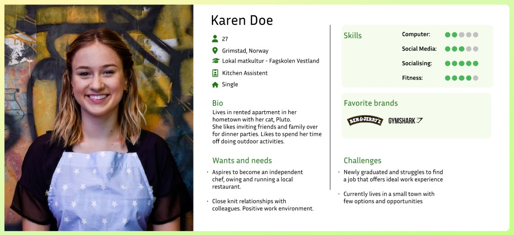
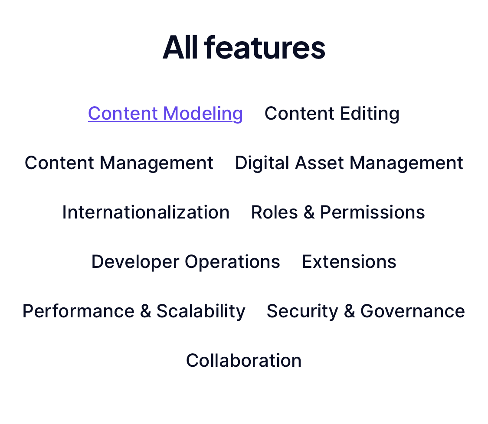
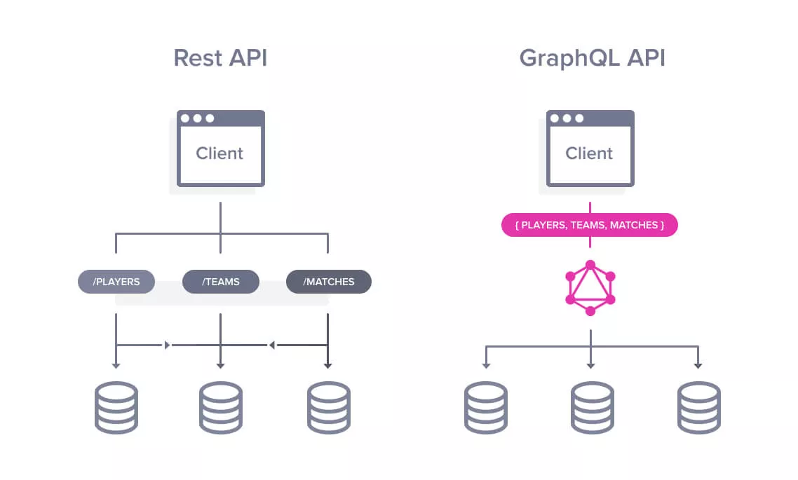
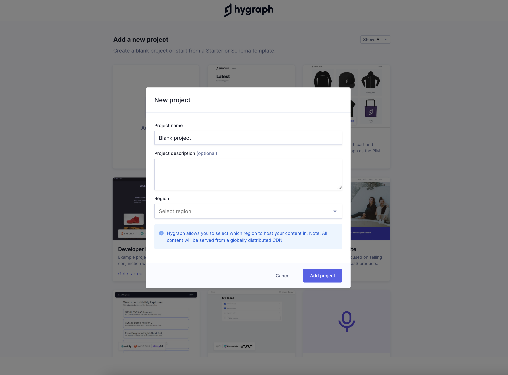
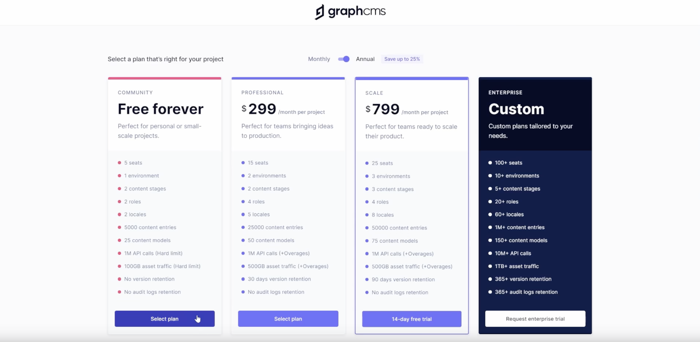
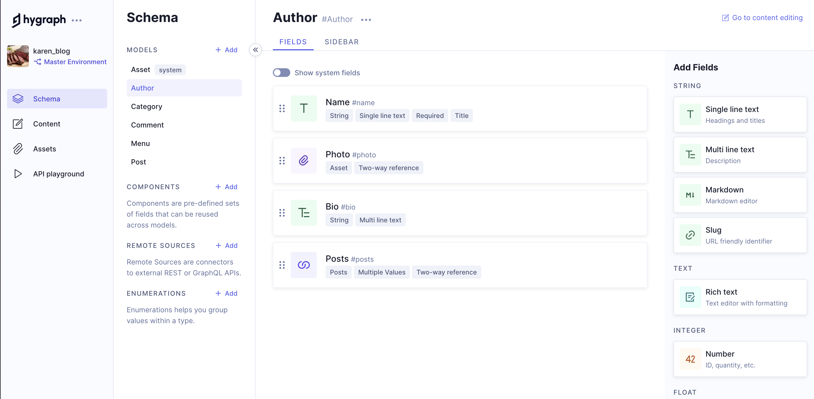

# Course Assignment: Development Platforms
**Website Hosting:** [Netlify](https://developmentplatforms.netlify.app/)  
**Project Report:** [GitHub Markdown](https://github.com/siljeangelvik/development_platforms_ca/blob/main/report.md)    
**GitHub Project Repo:** [Development Platforms ca](https://github.com/siljeangelvik/development_platforms_ca)  
**Repository Fork:** [development-platforms](https://github.com/NoroffFEU/development-platforms)  
**Report Format Template:** [GitHub Flavoured Markdown](https://github.com/siljeangelvik/development_platforms_ca/blob/main/template.md)  

## Introduction  
Karen is looking to write and share her recipes with family, friends and other cooking enthusiasts.   
The website should be easy to upload recipes, organize them into categories and manage   
her own collection with ease. Karen wants to make sure she can easily learn how to   
publish her recipes without it being too time-consuming or troublesome.  

### Our approach
We put focus on to the keywords in Karen's wishlist. She wants to **manage**, **organize** and **share** her   
recipes **easily**. The initial thought we had were like WordPress. But we didn't want to use a monolithic CMS.  
After some research we found that Hygraph provides us with the perfect combination of features and flexibility   
that meet Karen's needs. It allows us to quickly create content models and for Karen to easily manage, organize   
and share recipes with a few clicks. Not only can we create custom user-friendly interfaces and implement powerful   
search capabilities, but also keep full control of our product without having to worry about any potential issues.

We chose to use **React JS**, **NextJS**, **Tailwind CSS**, **GraphQL** and **GraphCMS** as the development technologies for this project.

### What?
* **React JS** is a front-end JavaScript library for building user interfaces based on components.
* **NextJS** provides an easy-to-use, fast and reliable platform for developers to build performant websites. It offers a powerful server rendering solution
* **TailwindCSS** is a utility-first CSS framework packed with classes that can be composed to build any design, directly in our markup.
* **GraphQL** is an open-source data query and manipulation language for APIs, and a query runtime engine.
* **Hygraph(GraphCMS)** is a back end-only web content management system that acts primarily as a content repository.   
It is hosted on a scalable state-of-the-art server architecture hosted by Amazon Web Services and based on PostgresQL.

### Why?
* We wanted easy production builds
* We wanted server-side rendering
* Static exporting options
* We wanted Karen to manage her own website with ease
* GraphCMS/Hygraph replaced the CMS part of WordPress
* GraphQL replaced both SQL and NoSQL but still keeping their respective benefits
* We wanted to try creating a website using something new

## Brief History
### Nextjs
**Initial release date:** October 25, 2016

**Next.js** was first released as an open-source project on GitHub on October 25, 2016.  
It was originally developed based on six principles: Out-of-the-Box functionality requiring no setup,   
JavaScript everywhere, all functions are written in JavaScript, automatic code-splitting and server-rendering,   
configurable data-fetching, anticipating requests, and simplifying deployment.   

**A very summarized list of additions to Next.js between 2017-2022:**  
* **V 2.0 Mar 2017:** Improved for smaller websites and scalability.  
* **V 7.0 Sep 2018:** Improved error handling and dynamic route handling (supporting React contextAPI).  
* **V 8.0 Feb 2019:** serverless app deployment, improved static exports and prefetch performance.  
* **V 9.3 Mar 2020:** optimization, global Sass and CSS module support.   
* **V 9.5 Jul 2020:** incremental static regeneration, rewrites, and redirect support  
* **V 11 Jun 2021:** Webpack 5, "Next.js Live".  
* **V 12 Oct 2021:** Rust compiler, AVIF support, Edge Functions & Middleware, and Native ESM & URL Imports.  
* **V 13 Oct 2022:** app directory that includes support for layouts, React server components, streaming, and a new set of data fetching methods.Turbo, changes to Next.js API.  

### Tailwind CSS
**Initial release date:**  November 1st, 2017

**TailwindCSS** was an “accident” and came to be as a by-product of another project by Adam Wathan.  
Initially built with Less (Leaner CSS) and inspired by bootstrap. Eventually the project grew too big to be maintained with Less,   
and therefore David Hemphill suggested to build the framework using postCSS instead. The first alfa version was released in Oct 2017.  

* **V 1.0 May 2019:** Official release
* **V 2.0 Nov 2020:** New color-palette, dark-mode support, minimizing breaking changes, form-styling,extended spacing, typography and opacity scales, as well as a bunch more features were added.
* **V 2.1 Mar 2021:** JIT (Just-In-Time) compiles all CSS on-demand rather than generating the entire stylesheet up front.
* **April 2021:** React + Vue support
* **V 3.0 Dec 2021:** JIT, more colors and lots of new styling options.

### GraphQL 
**Initial release date:** September 14, 2015

**2004 was the start** of the famous website we now know as “facebook”. Back then Apple was set on creating the best mobile browser,  
but ended up focusing too much on their native mobile apps and was left with a bad web browsing experience.  

* In **2012**, this led to the facebook development team working on a query language named GraphQL.
* In **2015**, they also introduced an open-source project called React. 
* **Between 2019-2021**, they released Relay that ties React and GraphQL together, and decided to make GraphQL open-source.

### Hygraph (GraphCMS)
**Hygraph** we found out is the best GraphQL content management system out there.  
It gives us instant GraphQL Content APIs to create, enrich, unify and deliver content across platforms.

The **GraphQL CMS** was an idea created by two friends in **2015** working for a DAM company. 
* The product was officially funded in **2017**. Initially named GraphCMS but then later changed to Hygraph.
* **In 2021**, they added some features such as improvements of the CMS layout, granular permissions,   
UI extensions and scheduled publishing. They also added a marketing website reference app   
and ecommerce. they added proper docs and opened a GraphQL community.
* **In 2022**, they changed name to Hygraph, introduced content federation,   
added commenting-feature, adding components, added new extensions   
for marketplace and launched hygraph.design.

## Features
**React** makes it easier to create dynamic web applications because it requires less coding and offers more functionality, as opposed to JavaScript, where coding often gets complex very quickly. Improved performance: React uses Virtual DOM, thereby creating web applications faster.

**Nextjs** gives developers the ability to do things like server-side rendering, which means the server reads through code and tells the browser what to display on the page. Server-side rendering creates faster, more versatile web applications.

**GraphQL** simplifies the task of aggregating data from multiple sources or APIs and then resolving the data to the client in a single API call.

**Hygraph** features content modeling where developers and content managers can easily set up content structures, or models, create custom workflows, and connect models to speed up creation.

* **Note:** Image shows only Hygraph features.

## Strengths
* Easy to use for both the client and the developer
* The GraphQL syntax is not so different from JSON
* Hygraph acts as both a Headless CMS and a powerful GraphQL database
* Delivers performance and scalability with the available features
* Offers a free plan

## Weaknesses
* Cost money for bigger or more projects
* We have yet to figure out more cons...

## Comparison
### Nextjs vs Svelte
NextJS enables us to create full-stack web applications by extending the latest   
React features. We’ll use Next JS pre-rendering with Static Generation.   
With NextJS we can create entire APIs without ever needing the backend.

### GraphQL vs REST
GraphQL has many advantages over REST. GraphQL is faster than REST because   
you can easily pick the fields you have to query. GraphQL provides a   
better learning curve as compared to REST.  

### GraphCMS vs WordPress
Next JS is specifically designed for server-side rendering and offers   
a range of features to make it easy for developers to build server-rendered   
React applications. Svelte also offers support for server-side rendering;   
however, compared to Next JS, it requires more setup and configuration.

## Journey
We started making an account for the **GraphCMS**, when we were logged in,   
we got the option of choosing a schema to work with or start blank.   
We went for starting on a new blank project.

#### We added some details to the new project:
**Project Name:** karen_blog  
**Project Description:** A virtual recipe book delivered by Karen   
**Region:** Germany (Frankfurt)

**! Note:** _Hygraph allows you to select which region to host your content in._  
_All content will be served from a globally distributed CDN_.  

GraphCMS has 4 different plan options: community, professional, scale and enterprise.  
In this case we went for the community version, which is the "free forever" option.  

After entering the dashboard, the first this we did was go to schema to make models.    
The models we created was Author, Category, Comment and Post.   

**! Note:** _Summary with more images or video will come..._

## Summary
As content management systems (CMS) become more and more popular, developers have to decide which CMS to use for their projects.   
WordPress has been the go-to option for many projects due to its ease of use, powerful features and flexibility.   
However, as technology advances, there are now other options available that can provide a better development experience.

**WordPress** is still the most popular CMS solution, but it is too monolithic, preventing it from being   
flexible enough to meet the needs of today's users. And as developers, as far as we're concerned,   
WordPress will not give us the needed support for improving our coding skills.

**Hygraph(GraphCMS)** gives the developer the ease of not having to hard-code their own back-end.   
Hygraph was a great option for our project because it provided a solid, intuitive platform.   
We utilized Hygraph's intuitive user interface which enabled us to quickly develop the website   
with minimal effort. It allowed us to develop the website quickly and easily, and gave Karen   
the opportunity to add her recipes with ease.

Using **GraphQL** makes it easy to exchange data at a single endpoint. 
In Hygraph, the `models` made in the `schema`-section could be compared to the `tables` in a database, and the `fields` would be the `columns`.  
Now, instead of the developer adding more `tables`, Karen can do that herself, as well as adding the `rows` to the `tables`, without the developer having to hard-code their way to achieve this.

It exist lots of documentation and a big community,  
and using it together with GraphQL gives you the opportunity to query for the specific endpoint, these tools are great and easy to use, 
as well as super flexible! And don’t forget that Karen can add her recipes whenever she wants, without having the developer do ANYTHING!

The video shows where to create the models using Hypgraph, and where to create the website content.

**Source:** [_Video Clip Showcasing Hygraph_](https://www.youtube.com/watch?v=7hnxVRcmN94)

## References
**Wikipedia:** [Nextjs](https://www.google.com/url?sa=t&rct=j&q=&esrc=s&source=web&cd=&cad=rja&uact=8&ved=2ahUKEwjQ89zihaT9AhXitYsKHW6TAPkQmhN6BAhiEAI&url=https%3A%2F%2Fen.wikipedia.org%2Fwiki%2FNext.js&usg=AOvVaw0B-Px8Rh7KearsjWzEctWw)  
**Wikipedia:** [Reactjs](https://www.google.com/url?sa=t&rct=j&q=&esrc=s&source=web&cd=&cad=rja&uact=8&ved=2ahUKEwi1x8zPhaT9AhXJwosKHQb6BhMQmhN6BAhkEAI&url=https%3A%2F%2Fen.wikipedia.org%2Fwiki%2FReact_(JavaScript_library)&usg=AOvVaw0YVCk9X7Sh1l7rf61OXIPW)  
**Wikipedia:** [GraphQL](https://www.google.com/url?sa=t&rct=j&q=&esrc=s&source=web&cd=&cad=rja&uact=8&ved=2ahUKEwiNq42dhqT9AhVolosKHRVqCBQQmhN6BAhjEAI&url=https%3A%2F%2Fen.wikipedia.org%2Fwiki%2FGraphQL&usg=AOvVaw2vBjxmxg9EAnjF3uFZE5Lt)  
**Docs:** [ReactJS](https://reactjs.org/)  
**Docs:** [NextJS](https://nextjs.org/)  
**Docs:** [TailwindCSS](https://tailwindcss.com/)  
**Docs:** [GraphQL](https://graphql.org/)  
**Docs:** [GraphCMS / Hygraph](https://hygraph.com/)  
**Video:** [Build and Deploy THE BEST Modern Blog App with React](https://www.youtube.com/watch?app=desktop&v=HYv55DhgTuA)   
**Gist:** [Tutorial Featured Post Card](https://gist.github.com/adrianhajdin/2b2e8509a48229baf9bb9b53d4a31c91)  
**Gist:** [Image Resize in GitHub Markdown](https://gist.github.com/uupaa/f77d2bcf4dc7a294d109)  
**Images:** [Pixabay](https://pixabay.com/no/photos/search/chicken%20fried%20rice/?manual_search=1)  
**GitHub:** [Add local repo to GitHub using GitHub CLI](https://docs.github.com/en/get-started/importing-your-projects-to-github/importing-source-code-to-github/adding-locally-hosted-code-to-github)  
**Recipe:** [Chicken Fried Rice](https://www.delish.com/cooking/recipe-ideas/a25635966/chicken-fried-rice-recipe/)  
**Article:** [The First Headless CMS Built Around GraphQL](https://www.cms-connected.com/News-Archive/September-2017/GraphCMS-The-First-Headless-Content-Management-System-Built-Around-GraphQL)  